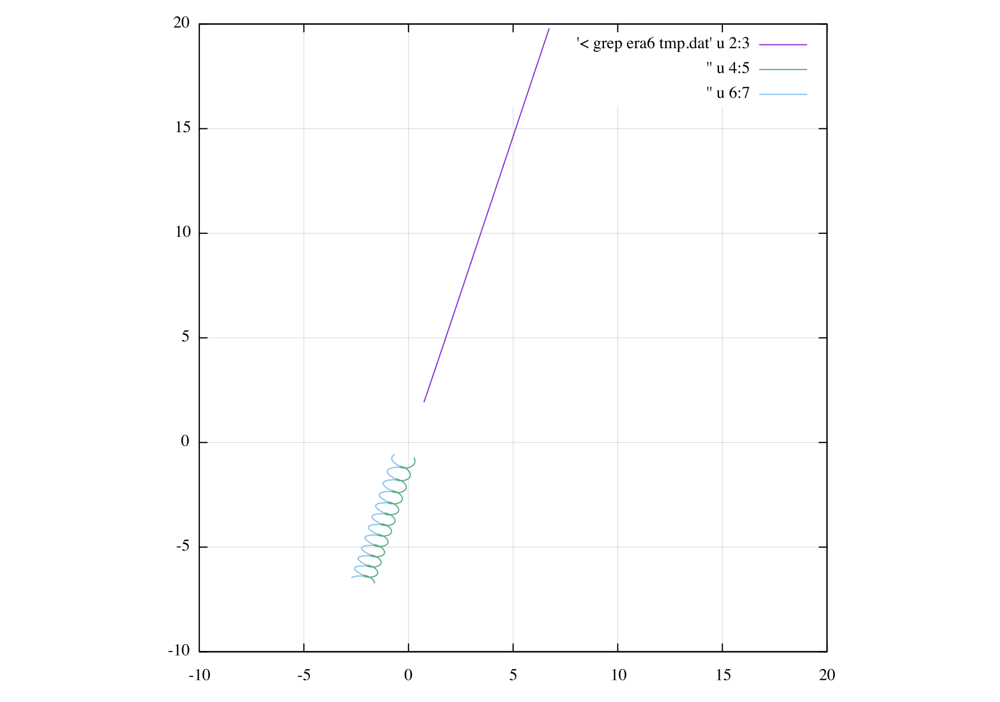

# UsingODEINT

## はじめに
Boost.Numeric.OdeintにあるRunge–Kutta–Fehlberg78等でピタゴラス三体問題をやってみようと思ったのですが、C++は難しくBoostは特に難しいのでいろいろとつまずくことが多かったので、覚え書きを残しておこうと思います。

常備分方程式のソルバーなのでやっていることはFORTRAN77の時代と変わることはなく、系の自由度、被積分変数を格納した配列と導関数を計算するサブルーチンを（C言語なら関数ポインタで）ソルバーに渡してやるだけです。Stepper、System、Status、Observerと難しそうな横文字がたくさん出てきますが、こいつらさえ整理しておけば大きな苦労はなく書けるのではないでしょうか。

## API

## 結果
60 <= t < 70での起動です。みため的には正しく計算できたようです。

プロットなのですが適当な時間区分をgrepできるようなテキスト出力をしておきgnuplotで
```
gnuplot> pl '< grep era1 tmp.dat' u 2:3 w l, '' u 4:5 w l, '' u 6:7 w 
```
のようにしています。

ちなみに精度のパラメータを緩めるとそれなりにエネルギーが保存していても全然違う結果になったりします。

## 参考
 * [C++で常微分方程式：boost::odeint入門](https://qiita.com/hmito/items/483445ac0d42fb4428a5)
 * [ピタゴラス3体問題で遊ぶ](https://qiita.com/i153/items/34674e267dd90298a245)
